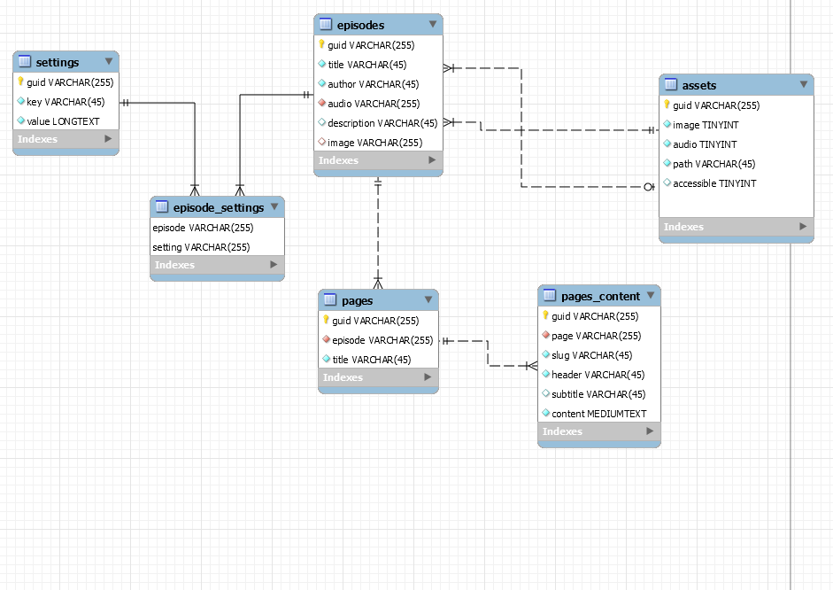

# minicasty | cis 451/551 final project

## repo

[http://github.com/ryangurn/minicasty](http://github.com/ryangurn/minicasty)

## name

ryan gurnick

## project title

minicasty

## connection information

redacted

## project url

http://ix.cs.uoregon.edu/~rgurnick/final

## highlights
* so far just being allowed to use laravel is a major highlight.
* using triggers to create guid on the mysql end when creating rows within select tables. it is far easier to do this with mysql than with laravel, however this has the side effect of causing issues with laravel's orm because mysql **technically** generates the information in the trigger after laravel creates memory for it... so there are some glitches that I work around.
* adding markdown support for the pages contents is quite awesome so that the user doesnt need to code. it only supports headers and paragraph stuff though, everything else will display as unstyled text.

## high level description / summary
this project is meant to provide podcast publishing services. there are many companies all over the internet that charge to generate an xml file and provide an interface to submit podcast information. i have decided to build a data model and interface to allow a normal person to self-host a podcast posting solution with some simple support. this application will handle metadata for one podcast and all of its episodes, it will handle secure file storage (utilizing the guid rather than allowing the user to access the file directly), and allow a user to publish a simple page online with content that relates to the podcast or an individual episode. 

in this application most of the fields in the database are strings, and i have decided to use an uuid as the primary key rather than an integer with auto increment to provide some level of security by obscurity when attempting to probe for assets. there are a variety of columns that are of the following types TEXT, MEDIUMTEXT, & LONGTEXT to support storing json objects within the table to prevent data segmentation through tables. lastly i utilize TIMESTAMPS to store date information about creation, the process of updating and other important dates, as well as TINYINT's that are either used as booleans or as a 0-9 set of options that are hard coded.  

most notably, the blue section at the top stores all the information related to the episodes directly, this is all of the information that allows for each episode to be generated in the xml output used for apple or spotify. in the settings group, that will allow for episodes to also have settings, as well as overall global settings (this will be used for storing the overall podcast settings too.) the assets and meta group will store information relating to uploaded images and mp3 files that will be accessible online via a secured file access url. there are a variety of standalone reference tables that are minimally related to, this group stored things like languages, countries, pages CRM styles, and apple podcasts categories. finally, we will get to the green section (pages + content) which will store the data related to the content on the simple CRM for the user. 

down below the data model are links to the official specs from apple and spotify that are roughly being used to define the data model. they provide excruciating information about the xml structure that i am converting into a mysql schema. (take a look this stuff is fascinating)

## data model (12/08/2020) 


### physical design
1. `episodes`: this all stems from the episodes table, which holds some crucial information. mainly the information that is consistently metadata between both apple and spotify. that is the title, reference to audio asset, publishing date, text description, boolean for explicit content, and optionally a reference to an episode image asset.
2. `itunes`: the itunes table contains all the itunes maintained attributes that might be requested, **note that just because apple maintains these attributes does not mean they are the only ones requiring them...** the attributes are an itunes specific title, episode number, season number, episode type (either trailer/full/bonus) and if the episode is blocked from being published for some reason. these attributes are all optional to the user.
3. `spotify`: the spotify table contains spotify maintained attributes that generally only they will request, this includes the order number for the episode, start and end dates for publishing, and keywords for search indexing. 
4. `spotify_restrictions`: this table is just a many to many join between the countries table and spotify table to allow for restricting the locations which the episodes are published. 
5. `assets`: the assets table is critically important to store information about the type of file (ie: audio/image) as well as the path itself. additionally, there is a boolean accessibility attribute to turn off specific assets if desired. 
6. `settings`: this table stores very simple key value data that is generally related to the overarching podcast itself, such as the podcasts title/description/image/author metadata/owner metadata and more... all neatly indexed by some simple keys.
7. `statistics`: the statistics table will collect basic view counts for episode audio pages as well as website page views for an episode specific page. this is to give some insight into the number of times an audio file is loaded and page is viewed. there are three main attributes, a reference to a page (nullable), a reference to an episode (nullable), and an integer count.
8. `pages`: the pages table stores simple metadata about a page, that is a reference to an episode, the slug for the url of the page, title of the page, and two bools to determine if we display the podcast and or episode info.
9. `pages_content`: this table stores content from within each page in a block type of way. the attributes start with a reference to a page, a header and subtitle string, along with content. **note: the content can be markdown and will be parsed into simple html, with minimal styling.**
10. `countries`: this table stores iso information about countries, the name, 2 digit + 3 digit country codes for use in the rss files and some dropdowns.
11. `categories`: this information is the categories recognized by apple and spotify for their podcasts, this is generally referenced by the settings table but there is no FK constraint on this. the attributes contain a circular reference back to categories for a parent category, a programming string, and a name for the category.
12. `languages`: this table stores iso information regarding languages. it has 3 main attributes: the name of the language, 2 digit abbreviation and 3 digit abbreviation.

## list of applications
1. **adjusting podcast settings**: there is functionality to adjust the overarching podcast settings, such as the podcast's title or description along with the podcast 'album' art. this can be achieved via the settings section on the website and will aptly modify various rows in the `settings` table. you can upload a new podcast 'album' art image which also adjusts the `assets` table after the upload has been verified as this is the location that the path information will be stored for future reference.
2. **adding episodes**: the user has the ability to add episodes into the podcast, when this is done a variety of rows are created starting with a row in the `episodes` table, then followed by a row in the `assets` table (for the audio file, possibly two rows if there is an image), lastly we create an empty row in the `itunes` and `spotify` tables just as placeholders for future use.
3. **updating episodes**: the user can update the episode at any time and depending on what information they desire to edit the queries will target either `episodes`,`itunes`, and or `spotify`, `spotify_restrictions` tables to adjust the stored data.
4. **reading episode information**: the user can view episode information from the `episodes`, `itunes`, `spotify`, `spotify_restrictions` table all on one simple page.
5. **deleting episodes**: the user can delete episodes which essentially touches most of the tables mainly in use. here is the list in order of execution: `statistics`, `assets`, `spotify_restrictions`, `spotify`, `itunes`, `pages_contents`, `statistics` ,`pages`, `episodes`
6. **creating a web page for a specific episode**: the user can create a web page that is located at `/page/{slug}` and add simple content blocks to each page. this generally utilizes `pages` for creating a page and then `pages_contents` for adding content blocks to a page using markdown.
7. **public view of web page**: the public view of a web page for an episode allows for the public to view a streamlined, and most importantly non-editable page. this functionality uses `pages`, `pages_contents`, and `statistics` for the public view, as well as `episode`, `itunes`, `spotify`, `spotify_restrictions`, and `settings` when using the display for podcast/episode on the page.
8. **update/delete functionality for pages**: the updating of pages, and their contents is crucial to proving page functionality, the user can update the information for the page and or content within it. this will affect the `pages` and `pages_contents` table.
9. **rss feed for submission to apple/spotify**: the rss feed is the most important part of this application, it compiles all the information into a form that apple and spotify can read and used to publish to their podcast libraries. this pulls together information from many tables such as `settings`, `assets`, `episodes`, `itunes`, `spotify`, `spotify_restrictions`, and `pages`.
10. **display podcast/episode information on an episode specific page**: displaying episode information or podcast information on the web pages created for episodes is important so that the listener can access the information straight from the source. if the user chooses to they can show podcast details and or episode details on the page created. this will use information from the `pages`, `episodes`, `settings`, `itunes`, `spotify`, and `spotify_restrictions` tables.

## user guide
you can find my user guide for this application on the [github wiki](https://github.com/ryangurn/minicasty/wiki), this is so that its centrally location and easy to update if needed.

## contents of the tables
### `episodes`

**note: the guid will not be the same... it depends on the time at which its seeded and _will_ be different**

the episodes table using the default seed will contain the following information, you can easily add more rows by using the web interface but this is the way the data will look from scratch.

| guid                                 | title                                                       | audio                                | publishing_date     | description                                                  | image | explicit |
| ------------------------------------ | ----------------------------------------------------------- | ------------------------------------ | ------------------- | ------------------------------------------------------------ | ----- | -------- |
| 467bbb3c-39b0-11eb-9b8f-0242ac110002 | Hiking Treks Trailer                                        | 4673da24-39b0-11eb-9b8f-0242ac110002 | 2017-01-10 01:15:00 | The Sunset Explorers share tips, techniques and recommendations for great hikes and adventures around the United States. | NULL  | 0        |
| 467d451b-39b0-11eb-9b8f-0242ac110002 | S02 EP04 Mt. Hood, Oregon                                   | 4674d1ee-39b0-11eb-9b8f-0242ac110002 | 2019-05-07 12:00:00 | Tips for trekking around the tallest mountain in Oregon      | NULL  | 0        |
| 467f29c4-39b0-11eb-9b8f-0242ac110002 | S02 EP03 Bouldering Around Boulder                          | 46759e7a-39b0-11eb-9b8f-0242ac110002 | 2019-04-30 18:00:00 | We explore fun walks to climbing areas about the beautiful Colorado city of Boulder. | NULL  | 0        |
| 4680dd3e-39b0-11eb-9b8f-0242ac110002 | S02 EP02 Caribou Mountain, Maine                            | 46766744-39b0-11eb-9b8f-0242ac110002 | 2019-05-28 09:00:00 | Put your fitness to the test with this invigorating hill climb. | NULL  | 0        |
| 4682344c-39b0-11eb-9b8f-0242ac110002 | S02 EP01 Stawamus Chief                                     | 46771c4a-39b0-11eb-9b8f-0242ac110002 | 2019-02-16 07:00:00 | We tackle Stawamus Chief outside of Vancouver, BC and you should too! | NULL  | 0        |
| 46839a6e-39b0-11eb-9b8f-0242ac110002 | S01 EP04 Kuliouou Ridge Trail                               | 4677bd21-39b0-11eb-9b8f-0242ac110002 | 2018-11-27 01:15:00 | Oahu, Hawaii, has some picturesque hikes and this is one of the best! | NULL  | 0        |
| 4684fd58-39b0-11eb-9b8f-0242ac110002 | S01 EP03 Blood Mountain Loop                                | 46785eda-39b0-11eb-9b8f-0242ac110002 | 2018-10-23 01:15:00 | Hiking the Appalachian Trail and Freeman Trail in Georgia    | NULL  | 0        |
| 468646ea-39b0-11eb-9b8f-0242ac110002 | S01 EP02 Garden of the Gods Wilderness                      | 4678fec4-39b0-11eb-9b8f-0242ac110002 | 2018-09-18 01:15:00 | Wilderness Area Garden of the Gods in Illinois is a delightful spot for an extended hike. | NULL  | 0        |
| 4687dae4-39b0-11eb-9b8f-0242ac110002 | S01 EP01 Upper Priest Lake Trail to Continental Creek Trail | 4678fec4-39b0-11eb-9b8f-0242ac110002 | 2018-08-14 01:15:00 | We check out this powerfully scenic hike following the river in the Idaho Panhandle National Forests. | NULL  | 0        |

### `itunes`

the itunes table has a guid that is a reference to the `episodes.guid` attribute and adds more nullable information such as the title, episode/season number, type, and block values for apple.

| guid                                 | title                | episode_number | season_number | type | block |
| ------------------------------------ | -------------------- | -------------- | ------------- | ---- | ----- |
| 467bbb3c-39b0-11eb-9b8f-0242ac110002 | Hiking Treks Trailer | NULL           | NULL          | 1    | 0     |
| 467d451b-39b0-11eb-9b8f-0242ac110002 | NULL                 | 4              | 2             | 0    | 0     |
| 467f29c4-39b0-11eb-9b8f-0242ac110002 | NULL                 | 3              | 2             | 0    | 0     |
| 4680dd3e-39b0-11eb-9b8f-0242ac110002 | NULL                 | 2              | 2             | 0    | 0     |
| 4682344c-39b0-11eb-9b8f-0242ac110002 | NULL                 | 1              | 2             | 0    | 0     |
| 46839a6e-39b0-11eb-9b8f-0242ac110002 | NULL                 | 4              | 1             | 0    | 0     |
| 4684fd58-39b0-11eb-9b8f-0242ac110002 | NULL                 | 3              | 1             | 0    | 0     |
| 468646ea-39b0-11eb-9b8f-0242ac110002 | NULL                 | 2              | 1             | 0    | 0     |
| 4687dae4-39b0-11eb-9b8f-0242ac110002 | NULL                 | 1              | 1             | 0    | 0     |

### `spotify`

the spotify table has data like whats below, with the guid being a reference to the `episodes.guid` attribute, adding in the order, start, end and keywords attributes to store that metadata for spotify.

| guid                                 | order | start | end  | keywords  |
| ------------------------------------ | ----- | ----- | ---- | --------- |
| 467bbb3c-39b0-11eb-9b8f-0242ac110002 | 0     | NULL  | NULL | Hiking    |
| 467d451b-39b0-11eb-9b8f-0242ac110002 | 1     | NULL  | NULL | Oregon    |
| 467f29c4-39b0-11eb-9b8f-0242ac110002 | 2     | NULL  | NULL | Boulder   |
| 4680dd3e-39b0-11eb-9b8f-0242ac110002 | 3     | NULL  | NULL | Maine     |
| 4682344c-39b0-11eb-9b8f-0242ac110002 | 4     | NULL  | NULL | Vancouver |
| 46839a6e-39b0-11eb-9b8f-0242ac110002 | 5     | NULL  | NULL | Hawaii    |
| 4684fd58-39b0-11eb-9b8f-0242ac110002 | 6     | NULL  | NULL | Georgia   |
| 468646ea-39b0-11eb-9b8f-0242ac110002 | 7     | NULL  | NULL | Illinois  |
| 4687dae4-39b0-11eb-9b8f-0242ac110002 | 8     | NULL  | NULL | Idaho     |

### `spotify_restrictions`

the spotify restrictions table contains two columns the first is the reference to the `spotify.guid` column that it relates to and the second column is the country column that relates to the `countries.guid` to create that relationship. this table effectively acts as a many to many relationship.

| spotify                              | country                              |
| ------------------------------------ | ------------------------------------ |
| 467bbb3c-39b0-11eb-9b8f-0242ac110002 | 4334523f-39b0-11eb-9b8f-0242ac110002 |
| 467bbb3c-39b0-11eb-9b8f-0242ac110002 | 440c1937-39b0-11eb-9b8f-0242ac110002 |
| 467d451b-39b0-11eb-9b8f-0242ac110002 | 4334523f-39b0-11eb-9b8f-0242ac110002 |
| 467d451b-39b0-11eb-9b8f-0242ac110002 | 440c1937-39b0-11eb-9b8f-0242ac110002 |
| 467f29c4-39b0-11eb-9b8f-0242ac110002 | 4334523f-39b0-11eb-9b8f-0242ac110002 |
| 467f29c4-39b0-11eb-9b8f-0242ac110002 | 440c1937-39b0-11eb-9b8f-0242ac110002 |
| 4680dd3e-39b0-11eb-9b8f-0242ac110002 | 4334523f-39b0-11eb-9b8f-0242ac110002 |
| 4680dd3e-39b0-11eb-9b8f-0242ac110002 | 440c1937-39b0-11eb-9b8f-0242ac110002 |
| 4682344c-39b0-11eb-9b8f-0242ac110002 | 4334523f-39b0-11eb-9b8f-0242ac110002 |
| 4682344c-39b0-11eb-9b8f-0242ac110002 | 440c1937-39b0-11eb-9b8f-0242ac110002 |
| 46839a6e-39b0-11eb-9b8f-0242ac110002 | 4334523f-39b0-11eb-9b8f-0242ac110002 |
| 46839a6e-39b0-11eb-9b8f-0242ac110002 | 440c1937-39b0-11eb-9b8f-0242ac110002 |
| 4684fd58-39b0-11eb-9b8f-0242ac110002 | 4334523f-39b0-11eb-9b8f-0242ac110002 |
| 4684fd58-39b0-11eb-9b8f-0242ac110002 | 440c1937-39b0-11eb-9b8f-0242ac110002 |
| 468646ea-39b0-11eb-9b8f-0242ac110002 | 4334523f-39b0-11eb-9b8f-0242ac110002 |
| 468646ea-39b0-11eb-9b8f-0242ac110002 | 440c1937-39b0-11eb-9b8f-0242ac110002 |
| 4687dae4-39b0-11eb-9b8f-0242ac110002 | 4334523f-39b0-11eb-9b8f-0242ac110002 |
| 4687dae4-39b0-11eb-9b8f-0242ac110002 | 440c1937-39b0-11eb-9b8f-0242ac110002 |

### `assets`

the assets table holds a couple important columns, the first is the guid that allows for unique referencing of the asset (this is used in the url for referencing audio/image files), second & third are booleans to determine if the asset is an image or audio file, fourth column is the path of the asset, fifth column changes if the asset is accessible to the public. this table creates relationships between the file system and the episode information.

| guid                                 | image | audio | path                                  | accessible |
| ------------------------------------ | ----- | ----- | ------------------------------------- | ---------- |
| 4671e474-39b0-11eb-9b8f-0242ac110002 | 1     | 0     | 20dbc889d70e623bafcc4b826884fceb.jpeg | 1          |
| 4673da24-39b0-11eb-9b8f-0242ac110002 | 0     | 1     | 0c940de445d5fd9653614eb31c419c7c.mp3  | 1          |
| 4674d1ee-39b0-11eb-9b8f-0242ac110002 | 0     | 1     | 0e0d5d47ea10c6965d889f4c3ec979c3.mp3  | 1          |
| 46759e7a-39b0-11eb-9b8f-0242ac110002 | 0     | 1     | 71b4635c001198b09007ea1190a0b522.mp3  | 1          |
| 46766744-39b0-11eb-9b8f-0242ac110002 | 0     | 1     | 7a9005ab57fa76531976aec9df3689dc.mp3  | 1          |
| 46771c4a-39b0-11eb-9b8f-0242ac110002 | 0     | 1     | 7cbe60e6e5aeb01f99a1b180d1033bca.mp3  | 1          |
| 4677bd21-39b0-11eb-9b8f-0242ac110002 | 0     | 1     | 8ed767a27808766598880221479dd6cb.mp3  | 1          |
| 46785eda-39b0-11eb-9b8f-0242ac110002 | 0     | 1     | 900eb727ad231a7efec1708889de0a9c.mp3  | 1          |
| 4678fec4-39b0-11eb-9b8f-0242ac110002 | 0     | 1     | ae1dc1d69928a1bf6d98f2dd1429b571.mp3  | 1          |
| 4679afd9-39b0-11eb-9b8f-0242ac110002 | 0     | 1     | bd034aea88d63d6f4084e73ca0e8af88.mp3  | 1          |

### `settings`

the settings table has three columns, a guid which is a unique value, key to reference the row, and the value. this table is just a key value store for things... all sorts of things. in here at the beginning of this application it mainly stores settings related to the overarching podcast itself.

| guid                                 | key                         | value                                                        |
| ------------------------------------ | --------------------------- | ------------------------------------------------------------ |
| 46586c07-39b0-11eb-9b8f-0242ac110002 | podcast-title               | "Hiking Treks"                                               |
| 4659f302-39b0-11eb-9b8f-0242ac110002 | podcast-description         | "Love to get outdoors and discover nature&apos;s treasures? Hiking Treks is the show for you. We review hikes and excursions, review outdoor gear and interview a variety of naturalists and adventurers. Look for new episodes each week." |
| 465c74fc-39b0-11eb-9b8f-0242ac110002 | podcast-image               | "4671e474-39b0-11eb-9b8f-0242ac110002"                       |
| 465eb6e5-39b0-11eb-9b8f-0242ac110002 | podcast-language            | "44b9380e-39b0-11eb-9b8f-0242ac110002"                       |
| 46602aba-39b0-11eb-9b8f-0242ac110002 | podcast-category            | ["426c616a-39b0-11eb-9b8f-0242ac110002","426dda9b-39b0-11eb-9b8f-0242ac110002"] |
| 4661c712-39b0-11eb-9b8f-0242ac110002 | podcast-explicit            | "false"                                                      |
| 466375e7-39b0-11eb-9b8f-0242ac110002 | podcast-author              | "The Sunset Explorers"                                       |
| 466588d3-39b0-11eb-9b8f-0242ac110002 | podcast-link                | "https:\/\/[www.apple.com](http://www.apple.com)\/itunes\/podcasts\/" |
| 4666aa23-39b0-11eb-9b8f-0242ac110002 | podcast-owners              | {"name":"Sunset Explorers","email":"[mountainscape@icloud.com](mailto:mountainscape@icloud.com)"} |
| 4667b06a-39b0-11eb-9b8f-0242ac110002 | podcast-itunes-title        | "Hiking Treks Trailer"                                       |
| 4668b804-39b0-11eb-9b8f-0242ac110002 | podcast-itunes-type         | "serial"                                                     |
| 4669ab96-39b0-11eb-9b8f-0242ac110002 | podcast-itunes-copyright    | "&#169; 2020 John Appleseed"                                 |
| 466a9904-39b0-11eb-9b8f-0242ac110002 | podcast-itunes-new-feed-url | NULL                                                         |
| 466ba2c4-39b0-11eb-9b8f-0242ac110002 | podcast-itunes-block        | "No"                                                         |
| 466ca342-39b0-11eb-9b8f-0242ac110002 | podcast-itunes-complete     | "No"                                                         |
| 466ded14-39b0-11eb-9b8f-0242ac110002 | podcast-spotify-country     | "440c1937-39b0-11eb-9b8f-0242ac110002"                       |
| 466f34d7-39b0-11eb-9b8f-0242ac110002 | podcast-spotify-limit       | "10"                                                         |
| 46706926-39b0-11eb-9b8f-0242ac110002 | podcast-spotify-origin      | "440c1937-39b0-11eb-9b8f-0242ac110002"                       |

### `statistics`

the statistics table has an episode reference to the `episodes.guid` and page reference to the `pages.guid` along with a count that acts as a view/listen counter. 

| guid                                 | episode                              | page                                 | count |
| ------------------------------------ | ------------------------------------ | ------------------------------------ | ----- |
| 46d8061d-39b0-11eb-9b8f-0242ac110002 | NULL                                 | 46b95561-39b0-11eb-9b8f-0242ac110002 | 0     |
| 46d9abd2-39b0-11eb-9b8f-0242ac110002 | NULL                                 | 46baa230-39b0-11eb-9b8f-0242ac110002 | 0     |
| 46db668d-39b0-11eb-9b8f-0242ac110002 | NULL                                 | 46bbb82d-39b0-11eb-9b8f-0242ac110002 | 0     |
| 46dcec8a-39b0-11eb-9b8f-0242ac110002 | NULL                                 | 46bd03b0-39b0-11eb-9b8f-0242ac110002 | 0     |
| 46de537d-39b0-11eb-9b8f-0242ac110002 | NULL                                 | 46be3eda-39b0-11eb-9b8f-0242ac110002 | 0     |
| 46dfa906-39b0-11eb-9b8f-0242ac110002 | NULL                                 | 46bf4600-39b0-11eb-9b8f-0242ac110002 | 0     |
| 46e0fa49-39b0-11eb-9b8f-0242ac110002 | NULL                                 | 46c04b7e-39b0-11eb-9b8f-0242ac110002 | 0     |
| 46e24909-39b0-11eb-9b8f-0242ac110002 | NULL                                 | 46c14d7c-39b0-11eb-9b8f-0242ac110002 | 0     |
| 46e39a9e-39b0-11eb-9b8f-0242ac110002 | NULL                                 | 46c25a48-39b0-11eb-9b8f-0242ac110002 | 0     |
| 46e4af7e-39b0-11eb-9b8f-0242ac110002 | 467bbb3c-39b0-11eb-9b8f-0242ac110002 | NULL                                 | 0     |
| 46e59e21-39b0-11eb-9b8f-0242ac110002 | 467d451b-39b0-11eb-9b8f-0242ac110002 | NULL                                 | 0     |
| 46e6a352-39b0-11eb-9b8f-0242ac110002 | 467f29c4-39b0-11eb-9b8f-0242ac110002 | NULL                                 | 0     |
| 46e79212-39b0-11eb-9b8f-0242ac110002 | 4680dd3e-39b0-11eb-9b8f-0242ac110002 | NULL                                 | 0     |
| 46e87957-39b0-11eb-9b8f-0242ac110002 | 4682344c-39b0-11eb-9b8f-0242ac110002 | NULL                                 | 0     |
| 46e9765a-39b0-11eb-9b8f-0242ac110002 | 46839a6e-39b0-11eb-9b8f-0242ac110002 | NULL                                 | 0     |
| 46ea745f-39b0-11eb-9b8f-0242ac110002 | 4684fd58-39b0-11eb-9b8f-0242ac110002 | NULL                                 | 0     |
| 46eb7960-39b0-11eb-9b8f-0242ac110002 | 468646ea-39b0-11eb-9b8f-0242ac110002 | NULL                                 | 0     |
| 46ec73fd-39b0-11eb-9b8f-0242ac110002 | 4687dae4-39b0-11eb-9b8f-0242ac110002 | NULL                                 | 0     |

### `pages`

the pages table has an episode reference to the `episodes.guid`, a slug that is used for the url of the page, a title for the page, and then two booleans that enable/disable the displaying of a podcast and or episode block on the page. the data provided is dummy data and is really nothing substantive.

| guid                                 | episode                              | slug    | title                | display_podcast | display_episode |
| ------------------------------------ | ------------------------------------ | ------- | -------------------- | --------------- | --------------- |
| 46b95561-39b0-11eb-9b8f-0242ac110002 | 467bbb3c-39b0-11eb-9b8f-0242ac110002 | Trailer | Hiking Treks Trailer | 0               | 0               |
| 46baa230-39b0-11eb-9b8f-0242ac110002 | 467d451b-39b0-11eb-9b8f-0242ac110002 | s2e4    | S2 E4                | 0               | 0               |
| 46bbb82d-39b0-11eb-9b8f-0242ac110002 | 467f29c4-39b0-11eb-9b8f-0242ac110002 | s2e3    | S2 E3                | 0               | 0               |
| 46bd03b0-39b0-11eb-9b8f-0242ac110002 | 4680dd3e-39b0-11eb-9b8f-0242ac110002 | s2e2    | S2 E2                | 0               | 0               |
| 46be3eda-39b0-11eb-9b8f-0242ac110002 | 4682344c-39b0-11eb-9b8f-0242ac110002 | s2e1    | S2 E1                | 0               | 0               |
| 46bf4600-39b0-11eb-9b8f-0242ac110002 | 46839a6e-39b0-11eb-9b8f-0242ac110002 | s1e4    | S1 E4                | 0               | 0               |
| 46c04b7e-39b0-11eb-9b8f-0242ac110002 | 4684fd58-39b0-11eb-9b8f-0242ac110002 | s1e3    | S1 E4                | 0               | 0               |
| 46c14d7c-39b0-11eb-9b8f-0242ac110002 | 468646ea-39b0-11eb-9b8f-0242ac110002 | s1e2    | S1 E2                | 0               | 0               |
| 46c25a48-39b0-11eb-9b8f-0242ac110002 | 4687dae4-39b0-11eb-9b8f-0242ac110002 | s1e1    | S1 E1                | 0               | 0               |

### `pages_contents`

the pages contents table has page which references `pages.guid`, header which is the header for the content section, the subtitle for the content section, and then the content itself (containing markdown text). the data provided is dummy data and is not at all substantive. 

| guid                                 | page                                 | header                           | subtitle                         | content                                                      |
| ------------------------------------ | ------------------------------------ | -------------------------------- | -------------------------------- | ------------------------------------------------------------ |
| 46c46d18-39b0-11eb-9b8f-0242ac110002 | 46b95561-39b0-11eb-9b8f-0242ac110002 | trailer trash                    | what fun!                        | "### Here is some content \n you can tell it is amazing!"    |
| 46c51111-39b0-11eb-9b8f-0242ac110002 | 46b95561-39b0-11eb-9b8f-0242ac110002 | content block #2                 | you can add as many as you like! | "please be sure to access this website from chrome or firefox... not safari" |
| 46c5d427-39b0-11eb-9b8f-0242ac110002 | 46b95561-39b0-11eb-9b8f-0242ac110002 | thanks                           | for being amazing                | "# i hope i get a good grade on this! \n i think this is kinda a cool little podcast app" |
| 46c75395-39b0-11eb-9b8f-0242ac110002 | 46baa230-39b0-11eb-9b8f-0242ac110002 | have you ever been?              | its the hoodiest!                | "please be sure to access this website from chrome or firefox... not safari" |
| 46c83b25-39b0-11eb-9b8f-0242ac110002 | 46baa230-39b0-11eb-9b8f-0242ac110002 | thanks                           | for being amazing                | "# i hope i get a good grade on this! \n i think this is kinda a cool little podcast app" |
| 46c9e352-39b0-11eb-9b8f-0242ac110002 | 46bbb82d-39b0-11eb-9b8f-0242ac110002 | hey thats kinda close to us      | boulder and boulder huh!         | "please be sure to access this website from chrome or firefox... not safari" |
| 46caa7e0-39b0-11eb-9b8f-0242ac110002 | 46bbb82d-39b0-11eb-9b8f-0242ac110002 | thanks                           | for being amazing                | "# i hope i get a good grade on this! \n i think this is kinda a cool little podcast app" |
| 46cc028c-39b0-11eb-9b8f-0242ac110002 | 46bd03b0-39b0-11eb-9b8f-0242ac110002 | maine seems like the place to be | i here there is cheap land!      | "please be sure to access this website from chrome or firefox... not safari" |
| 46cca97e-39b0-11eb-9b8f-0242ac110002 | 46bd03b0-39b0-11eb-9b8f-0242ac110002 | thanks                           | for being amazing                | "# i hope i get a good grade on this! \n i think this is kinda a cool little podcast app" |
| 46ce0110-39b0-11eb-9b8f-0242ac110002 | 46be3eda-39b0-11eb-9b8f-0242ac110002 | walking walking walking...       | hydrate to operate!              | "please be sure to access this website from chrome or firefox... not safari" |
| 46cea37d-39b0-11eb-9b8f-0242ac110002 | 46be3eda-39b0-11eb-9b8f-0242ac110002 | thanks                           | for being amazing                | "# i hope i get a good grade on this! \n i think this is kinda a cool little podcast app" |
| 46cfebc7-39b0-11eb-9b8f-0242ac110002 | 46bf4600-39b0-11eb-9b8f-0242ac110002 | something about hiking           | content!!                        | "please be sure to access this website from chrome or firefox... not safari" |
| 46d09eb2-39b0-11eb-9b8f-0242ac110002 | 46bf4600-39b0-11eb-9b8f-0242ac110002 | thanks                           | for being amazing                | "# i hope i get a good grade on this! \n i think this is kinda a cool little podcast app" |
| 46d1e5d0-39b0-11eb-9b8f-0242ac110002 | 46c04b7e-39b0-11eb-9b8f-0242ac110002 | like a magic trick               | poof!                            | "please be sure to access this website from chrome or firefox... not safari" |
| 46d2831c-39b0-11eb-9b8f-0242ac110002 | 46c04b7e-39b0-11eb-9b8f-0242ac110002 | thanks                           | for being amazing                | "# i hope i get a good grade on this! \n i think this is kinda a cool little podcast app" |
| 46d3db79-39b0-11eb-9b8f-0242ac110002 | 46c14d7c-39b0-11eb-9b8f-0242ac110002 | more and more                    | you can add as many as you like! | "please be sure to access this website from chrome or firefox... not safari" |
| 46d4792e-39b0-11eb-9b8f-0242ac110002 | 46c14d7c-39b0-11eb-9b8f-0242ac110002 | thanks                           | for being amazing                | "# i hope i get a good grade on this! \n i think this is kinda a cool little podcast app" |
| 46d5bc3f-39b0-11eb-9b8f-0242ac110002 | 46c25a48-39b0-11eb-9b8f-0242ac110002 | dynamic content                  | you can add as many as you like! | "please be sure to access this website from chrome or firefox... not safari" |
| 46d66559-39b0-11eb-9b8f-0242ac110002 | 46c25a48-39b0-11eb-9b8f-0242ac110002 | thanks                           | for being amazing                | "# i hope i get a good grade on this! \n i think this is kinda a cool little podcast app" |

### `countries`

the countries table has a name column that stores the name of the country along with 2_digit and 3_digit country codes as provided by one of the iso standard that both apple and spotify recognize. i am truncating much of this information for documentation purposes because its just countries... nothing special

| guid                                 | name                     | 2_digit | 3_digit |
| ------------------------------------ | ------------------------ | ------- | ------- |
| 430d8804-39b0-11eb-9b8f-0242ac110002 | Andorra                  | AD      | AND     |
| 430eaf06-39b0-11eb-9b8f-0242ac110002 | The United Arab Emirates | AE      | ARE     |
| 430fc99e-39b0-11eb-9b8f-0242ac110002 | Afghanistan              | AF      | AFG     |
| 43111639-39b0-11eb-9b8f-0242ac110002 | Antigua and Barbuda      | AG      | ATG     |
| 43124f5a-39b0-11eb-9b8f-0242ac110002 | Anguilla                 | AI      | AIA     |
| 4313cd19-39b0-11eb-9b8f-0242ac110002 | Albania                  | AL      | ALB     |
| 43150143-39b0-11eb-9b8f-0242ac110002 | Armenia                  | AM      | ARM     |
| 4315fc46-39b0-11eb-9b8f-0242ac110002 | Angola                   | AO      | AGO     |
| 4316fc88-39b0-11eb-9b8f-0242ac110002 | Antarctica               | AQ      | ATA     |
| 4317efc9-39b0-11eb-9b8f-0242ac110002 | Argentina                | AR      | ARG     |
| 4318f10d-39b0-11eb-9b8f-0242ac110002 | American Samoa           | AS      | ASM     |
| 4319e3f6-39b0-11eb-9b8f-0242ac110002 | Austria                  | AT      | AUT     |
| 431ad883-39b0-11eb-9b8f-0242ac110002 | Australia                | AU      | AUS     |
| 431bdd99-39b0-11eb-9b8f-0242ac110002 | Aruba                    | AW      | ABW     |
| 431cd655-39b0-11eb-9b8f-0242ac110002 | Åland Islands            | AX      | ALA     |

### `categories`

the categories table contains a parent reference column that relates back to the `categories.guid` as a self reference, in addition there is the programming column that has the text output into the rss file and the name column that displayed to the user in the web interface. the data below is truncated since there is far too much of it to nicely show in this documentation.

| guid                                 | parent                               | programming          | name             |
| ------------------------------------ | ------------------------------------ | -------------------- | ---------------- |
| 426c616a-39b0-11eb-9b8f-0242ac110002 | NULL                                 | Arts                 | Arts             |
| 426dda9b-39b0-11eb-9b8f-0242ac110002 | 426c616a-39b0-11eb-9b8f-0242ac110002 | Books                | Books            |
| 426f7f88-39b0-11eb-9b8f-0242ac110002 | 426c616a-39b0-11eb-9b8f-0242ac110002 | Design               | Design           |
| 4270f252-39b0-11eb-9b8f-0242ac110002 | 426c616a-39b0-11eb-9b8f-0242ac110002 | Fashion &amp; Beauty | Fashion & Beauty |
| 42729f83-39b0-11eb-9b8f-0242ac110002 | 426c616a-39b0-11eb-9b8f-0242ac110002 | Food                 | Food             |
| 4274150e-39b0-11eb-9b8f-0242ac110002 | 426c616a-39b0-11eb-9b8f-0242ac110002 | Performing Arts      | Performing Arts  |
| 4276e49f-39b0-11eb-9b8f-0242ac110002 | 426c616a-39b0-11eb-9b8f-0242ac110002 | Visual Arts          | Visual Arts      |
| 4278ab56-39b0-11eb-9b8f-0242ac110002 | NULL                                 | Business             | Business         |
| 427ada1b-39b0-11eb-9b8f-0242ac110002 | 4278ab56-39b0-11eb-9b8f-0242ac110002 | Careers              | Careers          |
| 427d5ed6-39b0-11eb-9b8f-0242ac110002 | 4278ab56-39b0-11eb-9b8f-0242ac110002 | Entrepreneurship     | Entrepreneurship |
| 42803458-39b0-11eb-9b8f-0242ac110002 | 4278ab56-39b0-11eb-9b8f-0242ac110002 | Investing            | Investing        |
| 428206d3-39b0-11eb-9b8f-0242ac110002 | 4278ab56-39b0-11eb-9b8f-0242ac110002 | Management           | Management       |
| 42839aa0-39b0-11eb-9b8f-0242ac110002 | 4278ab56-39b0-11eb-9b8f-0242ac110002 | Marketing            | Marketing        |
| 428511f6-39b0-11eb-9b8f-0242ac110002 | 4278ab56-39b0-11eb-9b8f-0242ac110002 | Non-Profit           | Non-Profit       |

### `languages`

the languages table contains a name column for the name of the language, and then 3_digit and 2_digit language codes as provided by some iso standard that both apple and spotify recognize for the rss file. I am truncating much of this information for documentation purposes because its just languages... nothing special

| guid                                 | name                   | 3_digit | 2_digit |
| ------------------------------------ | ---------------------- | ------- | ------- |
| 44225c19-39b0-11eb-9b8f-0242ac110002 | Afar                   | aar     | aa      |
| 4423b86e-39b0-11eb-9b8f-0242ac110002 | Abkhazian              | abk     | ab      |
| 442501c3-39b0-11eb-9b8f-0242ac110002 | Achinese               | ace     |         |
| 44266a47-39b0-11eb-9b8f-0242ac110002 | Acoli                  | ach     |         |
| 4427b49a-39b0-11eb-9b8f-0242ac110002 | Adangme                | ada     |         |
| 4428e7de-39b0-11eb-9b8f-0242ac110002 | Adyghe / Adygei        | ady     |         |
| 4429fb5b-39b0-11eb-9b8f-0242ac110002 | Afro-Asiatic languages | afa     |         |
| 442b033c-39b0-11eb-9b8f-0242ac110002 | Afrihili               | afh     |         |
| 442c0e05-39b0-11eb-9b8f-0242ac110002 | Afrikaans              | afr     | af      |
| 442d1012-39b0-11eb-9b8f-0242ac110002 | Ainu                   | ain     |         |
| 442e1578-39b0-11eb-9b8f-0242ac110002 | Akan                   | aka     |         |
| 442f1d8f-39b0-11eb-9b8f-0242ac110002 | Akkadian               | akk     |         |
| 4430338c-39b0-11eb-9b8f-0242ac110002 | Albanian               | alb     | sq      |
| 44314a9b-39b0-11eb-9b8f-0242ac110002 | Albanian               | sqi     | sq      |
| 44325341-39b0-11eb-9b8f-0242ac110002 | Aleut                  | ale     |         |

## implemented code

the implemented code can be found easily on [my github](https://github.com/ryangurn/minicasty)

## conclusion
with this project i was able to build a very simple application that allows for the publishing of a single podcast. this allows you to setup and modify the podcasts settings (title, description, 'album' art, etc) as well as add episode content (title, description, image, audio, etc) into that podcast. i went one step further and even built a simple cms that allows for the creation of a single page to go along with each episode uploaded so that the podcast publisher can provide a web page to go along with the auditory content. 
on each page you can also use markdown to insert headings and paragraph sections into the content of each page. this application has dynamic audio and image handling so that the guid of the asset is the value in the uri that references the image, thus allowing for greater access control on assets. the application also provides the properly generated rss feeds needed to get the podcast published to apples podcast library and or spotify podcasts. 

for the future i would add authentication to this application and strive to provide support for multiple podcasts. additionally i think that adding in greater markdown support for the page content would be great along with more controls over the way the content renders on the page. 

## helpful things
* interesting note: all the podcasts on platforms like spotify and apple podcasts are either self hosted and stored on the podcast owner's server or managed on a server by a distribution company that charges. apple and spotify do not store the audio directly (genius, and a really great way for them to save money and allow for the owner to remain in complete control.)
* when working on a local machine, i wanted to use the same mysql version as ix, but ran into the issue of already having mariadb installed and running for other critical purposes on the same port. in dealing with this i decided to use docker on my local machine to work around this and just change the localhost port to '3307' with this i present the following helpful thing a command to docker that will setup the system properly for us. ```docker run -d -p 3307:3306 --name mysql -e MYSQL_DATABASE=minicasty -e MYSQL_USER=minicasty -e MYSQL_PASSWORD=123 -e MYSQL_ROOT_PASSWORD=123 -e MYSQL_ROOT_HOST=% -d mysql/mysql-server:8.0.22-1.1.18 --default-authentication-plugin=mysql_native_password``` just know that the username is minicasty and the password is 123 for that user and also root. this is just meant for testing on a local machine with docker
* [Apple Podcast Specification](https://help.apple.com/itc/podcasts_connect/#/itcb54353390)
* [Spotify Podcast Specification](https://podcasters.spotify.com/terms/Spotify_Podcast_Delivery_Specification_v1.6.pdf)

