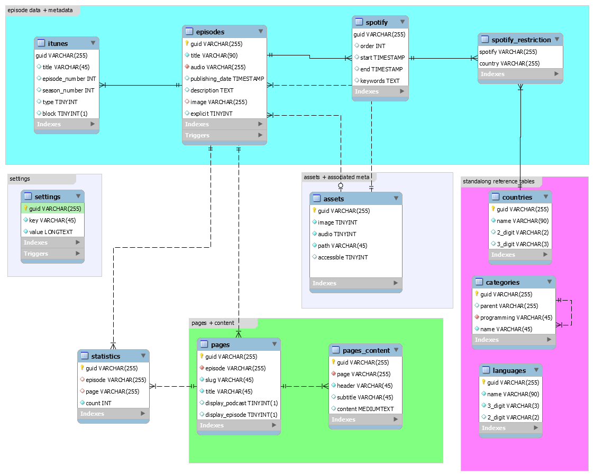

# minicasty | cis 451/551 final project

## name

ryan gurnick

## project title

minicasty

## connection information

redacted for security here!

## project url

http://ix.cs.uoregon.edu/~rgurnick/final

## highlights
* so far just being allowed to use laravel is a major highlight.

## high level description
this project is meant to provide podcast publishing services. there are many companies all over the internet that charge to generate an xml file and provide an interface to submit podcast information. i have decided to build a data model and interface to allow a normal person to self-host a podcast posting solution with some simple support. this application will handle metadata for one podcast and all of its episodes, it will handle secure file storage (utilizing the guid rather than allowing the user to access the file directly), and allow a user to publish a simple page online with content that relates to the podcast or an individual episode. 

in this application most of the fields in the database are strings, and i have decided to use an uuid as the primary key rather than an integer with auto increment to provide some level of security by obscurity when attempting to probe for assets. there are a variety of columns that are of the following types TEXT, MEDIUMTEXT, & LONGTEXT to support storing json objects within the table to prevent data segmentation through tables. lastly i utilize TIMESTAMPS to store date information about creation, the process of updating and other important dates, as well as TINYINT's that are either used as booleans or as a 0-9 set of options that are hard coded.  

most notably, the the blue section at the top stores all of the information related to the episodes directly, this is all of the information that allows for each episode to be generated in the xml output used for apple or spotify. in the settings group, that will allow for episodes to also have settings, as well as overall global settings (this will be used for storing the overall podcast settings too.) the assets and meta group will store information relating to uploaded images and mp3 files that will be accessible online via a secured file access url. there are a variety of standalone reference tables that are minimally related to, this group stored things like languages, countries, pages CRM styles, and apple podcasts categories. finally, we will get to the green section (pages + content) which will store the data related to the content on the simple CRM for the user. 

down below the data model are links to the official specs from apple and spotify that are roughly being used to define the data model. they provide excruciating information about the xml structure that i am converting into a mysql schema. (take a look this stuff is fascinating)

## data model (11/11/2020) 


## helpful things
* interesting note: all the podcasts on platforms like spotify and apple podcasts are either self hosted and stored on the podcast owner's server or managed on a server by a distribution company that charges. apple and spotify do not store the audio directly (genius, and a really great way for them to save money and allow for the owner to remain in complete control.)
* when working on a local machine, i wanted to use the same mysql version as ix, but ran into the issue of already having mariadb installed and running for other critical purposes on the same port. in dealing with this i decided to use docker on my local machine to work around this and just change the localhost port to '3307' with this i present the following helpful thing a command to docker that will setup the system properly for us. ```docker run -d -p 3307:3306 --name mysql -e MYSQL_DATABASE=minicasty -e MYSQL_USER=minicasty -e MYSQL_PASSWORD=123 -e MYSQL_ROOT_PASSWORD=123 -e MYSQL_ROOT_HOST=% -d mysql/mysql-server:8.0.22-1.1.18 --default-authentication-plugin=mysql_native_password``` just know that the username is minicasty and the password is 123 for that user and also root. this is just meant for testing on a local machine with docker
* [Apple Podcast Specification](https://help.apple.com/itc/podcasts_connect/#/itcb54353390)
* [Spotify Podcast Specification](https://podcasters.spotify.com/terms/Spotify_Podcast_Delivery_Specification_v1.6.pdf)
